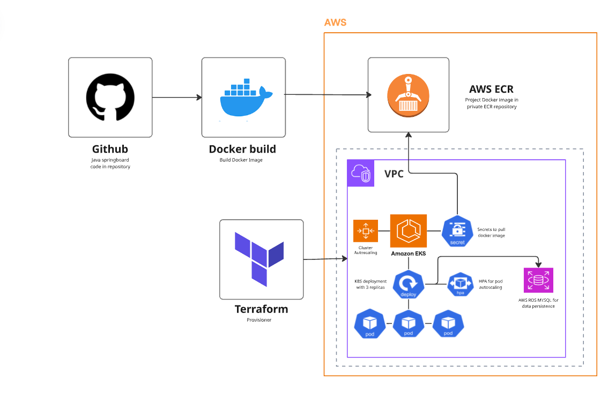

# E-Commerce Application Deployment on AWS EKS


## Overview

Deployed a production-ready e-commerce Java application on AWS EKS using Terraform for infrastructure provisioning. The setup includes a containerized application, autoscaling, and a managed MySQL database via AWS RDS.

## Architecture



The deployment follows a clean pipeline:
- Source code pushed from **GitHub**
- Java application **Dockerized** and pushed to **Amazon ECR**
- **Terraform** provisions the EKS cluster on AWS
- Application deployed on **EKS** with Horizontal Pod Autoscaler (HPA)
- **AWS RDS MySQL** handles persistent data storage

## Tech Stack

| Layer | Technology |
|-------|-----------|
| Container orchestration | AWS EKS (Kubernetes) |
| Infrastructure as Code | Terraform |
| Containerization | Docker |
| Image registry | Amazon ECR |
| Database | AWS RDS MySQL |
| Application | Java (Spring Boot) |
| Autoscaling | Kubernetes HPA |

## What Was Built

**1. Dockerized the Java application**
- Wrote a `Dockerfile` to build and package the Spring Boot app
- Pushed the image to Amazon ECR

**2. Provisioned EKS cluster with Terraform**
- Created VPC, subnets (public/private), and IAM roles using Terraform modules
- Deployed a managed EKS cluster with worker node groups

**3. Deployed application on EKS**
- Wrote Kubernetes manifests: `Deployment`, `Service`, `HPA`
- Configured HPA to scale pods based on CPU utilization
- Connected the application to RDS MySQL via Kubernetes `Secret` for credentials

**4. Set up AWS RDS MySQL**
- Provisioned RDS instance in a private subnet
- Configured security groups to allow traffic only from EKS worker nodes
- Validated database connectivity from within the cluster

## Project Structure

```
├── terraform/
│   ├── main.tf
│   ├── variables.tf
│   ├── vpc.tf
│   ├── eks.tf
├── k8s/
│   ├── deployment.yaml
│   ├── serivce.yaml
└── README.md
```

## Key Learnings

- Terraform state management for EKS cluster lifecycle
- Configuring HPA thresholds for a Java application under load
- Securing RDS access from within a Kubernetes cluster using security groups and secrets
